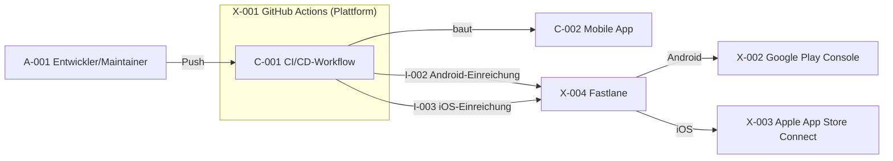

# Struktur

Die statische Struktur. **Aus welchen Komponenten besteht das Ganze?**

Keine Abläufe. Keine Reihenfolgen. Nur: Was ist da, und wie hängt es zusammen.

## So arbeitest du mit diesem Template

Der Text hier ist der **Anker**. Das Diagramm ist die **Überprüfung**.

1. Beschreibe die Komponenten textuell.
2. Lass das Diagramm generieren (Mermaid oder echtes Bild).
3. Schau es an.
4. Ändere den Text, wenn nötig.
5. Wiederhole 2–4, bis es passt.

Der Kreislauf endet, wenn **du** sagst: „So passt es."

## Fragen

### 1. Welche Komponenten gibt es?

Für jede Komponente:
- **ID**
- **Name**
- **Aufgabe** — was tut sie, in einem Satz?
- **Rolle** — zentral oder peripher? (siehe Frage 5)
- **Dient** — welchem Ziel? (`G-`)
- **Verarbeitet** — welche Entitäten aus `daten.md`? (`D-`, wenn welche)
- **Beachtet** — welches Nicht-Ziel begrenzt sie? (`NG-`, wenn eines)

#### C-001 CI/CD-Workflow

- **Aufgabe:** Baut und testet die App bei jedem Push, signiert sie auf
  Knopfdruck und reicht sie in die Testschienen von Google Play und
  Apple TestFlight ein.
- **Rolle:** zentral.
- **Dient:** G-001, G-002, G-003.
- **Verarbeitet:** —
- **Beachtet:** NG-003 (keine manuellen Schritte), NG-004 (kein
  öffentlicher Store-Release).

#### C-002 Mobile App

- **Aufgabe:** Zeigt "Hello World" bzw. "Hallo Welt" an — ein
  gemeinsames Kotlin-Multiplatform/Compose-Multiplatform-Modul für
  Android und iOS.
- **Rolle:** peripher — Träger, an dem die Pipeline sichtbar wird.
- **Dient:** G-003.
- **Verarbeitet:** —
- **Beachtet:** NG-001 (keine echte Funktionalität), NG-002 (kein
  Backend).

### 2. Wie hängen die Komponenten zusammen?

Welche Komponente ruft welche auf? Welche liefert Daten an welche?

Als Diagramm. (Mermaid.)

### 3. Welche Interfaces hat jede Komponente?

Für jedes Interface:
- **ID**
- **Gehört zu** — welche Komponente? (`C-`)
- **Eingabe** — was bekommt sie?
- **Ausgabe** — was liefert sie?
- **Empfänger** — wer bekommt die Ausgabe? (nicht „Aufrufer": bei einer
  Datenhaltung ruft niemand auf, dort wird geschrieben und gelesen)
- **Was wird übergeben?** — Format, Inhalt
- **Bei Erfolg** — was passiert danach?
- **Bei Fehler** — was passiert daneben?

#### I-001 Push-Trigger

- **Gehört zu:** C-001.
- **Eingabe:** Git-Push auf das Repository (Branch `main`).
- **Ausgabe:** Build- und Testergebnis von C-002.
- **Empfänger:** die Stufen I-002 und I-003 innerhalb der Pipeline.
- **Was wird übergeben:** Source-Stand des Commits.
- **Bei Erfolg:** Pipeline geht in Android- und iOS-Einreichung über.
- **Bei Fehler:** Pipeline bricht ab, Fehlermeldung im Actions-Log,
  keine Einreichung.

#### I-002 Android-Einreichung

- **Gehört zu:** C-001.
- **Eingabe:** signiertes Android-Build-Artefakt (AAB) aus C-002.
- **Ausgabe:** eingereichtes Release.
- **Empfänger:** X-002 Google Play Console, über X-004 Fastlane.
- **Was wird übergeben:** AAB + Store-Metadaten.
- **Bei Erfolg:** Release erscheint in der Play Console im internen Test.
- **Bei Fehler:** Fastlane/Play-API meldet Fehler, Workflow schlägt
  fehl.

#### I-003 iOS-Einreichung

- **Gehört zu:** C-001.
- **Eingabe:** signiertes iOS-Build-Artefakt (IPA) aus C-002.
- **Ausgabe:** eingereichtes Release.
- **Empfänger:** X-003 Apple App Store Connect, über X-004 Fastlane.
- **Was wird übergeben:** IPA + Store-Metadaten.
- **Bei Erfolg:** Build erscheint in TestFlight für die internen Tester.
- **Bei Fehler:** Fastlane/App-Store-Connect-API meldet Fehler, Workflow
  schlägt fehl — die Meldung gilt selbst als Ergebnis, siehe G-002.

#### I-004 App-Start

- **Gehört zu:** C-002.
- **Eingabe:** Start durch das Betriebssystem (Android/iOS).
- **Ausgabe:** "Hello World"- bzw. "Hallo Welt"-Text auf dem Bildschirm.
- **Empfänger:** wer die App öffnet (Tester).
- **Was wird übergeben:** Text-String aus dem Source.
- **Bei Erfolg:** Text sichtbar.
- **Bei Fehler:** App stürzt ab oder zeigt nichts.

### 4. Welche Komponenten sind extern?

Nur die Namen. Die Details kommen in `extern.md`.

- X-001 GitHub Actions
- X-002 Google Play Console
- X-003 Apple App Store Connect
- X-004 Fastlane

### 5. Was ist die Kernlogik in der Struktur?

Die Kernlogik ist das, **um das die peripheren Komponenten herum sind**.

- Welche Komponente oder welcher **Akteur** ist der **Mittelpunkt**?
- Welche Komponenten sind **peripher**?
- Wenn kein einzelnes Artefakt der Mittelpunkt ist: **Welche Komposition**
  aus Komponenten und Akteuren ist der Mittelpunkt?

Mittelpunkt ist C-001, der CI/CD-Workflow. Peripher sind C-002 (die App,
die nur gebaut und gezeigt wird) und alle externen Komponenten
(X-001..X-004), die C-001 benutzt, um das Ergebnis auszuliefern.

### 6. Wer handelt im System, ohne gebaut zu werden?

Die Akteure. Für jeden:
- **ID**
- **Rolle** — was darf und muss er tun?
- **Was er bedient** — Screens, Schnittstellen
- **Was das System von ihm erwartet** — und was passiert, wenn er es nicht tut

#### A-001 Entwickler/Maintainer

- **Rolle:** Ändert den Source (z. B. "Hello World" → "Hallo Welt") und
  pusht auf GitHub.
- **Was er bedient:** I-001 (Push-Trigger).
- **Was das System von ihm erwartet:** kompilierbaren, testbestandenen
  Code. Tut er das nicht, bricht I-001 ab, ohne dass etwas eingereicht
  wird.

Ein Akteur ist eine Rolle, keine Person. Fallen zwei Rollen auf dieselbe
Person, schreib das als Annahme auf — sie kann sich ändern.

Akteure sind **nicht** extern: Sie stehen innerhalb der Systemgrenze.
Extern ist, was das System benutzt; ein Akteur ist, wer es benutzt.

## Was hier entsteht

- `C-` Komponenten
- `I-` Interfaces
- `A-` Akteure

Ordner: `projekt/struktur/`

Ein abgestimmter Eintrag trägt darunter die Zeile
`Abgestimmt: <wer>, <wann>` — ab dann ist seine ID verbraucht und wird bei
Aufgabe ausgemustert statt umnummeriert (`metamodell.md`).

Ausgemustert: —

## Querverweise

Dieses Template erzeugt **drei** Artefaktarten, deshalb je Art getrennt:

- **A- geht aus:** `bedient` → S-, I-
- **A- kommt an:** `betrifft` von RISK-, `entscheidet-ueber` von ADR-
- **C- geht aus:** `dient` → G-, `beachtet` → NG-, `verarbeitet` → D-
- **C- kommt an:** `gehoert-zu` von I-, `zeigt` von S-, `prueft` von T-,
  `benutzt-von` von X-, `gehalten-von` von D-, `betrifft` von RISK-,
  `entscheidet-ueber` von ADR-
- **I- geht aus:** `gehoert-zu` → C-
- **I- kommt an:** `bedient` von A-, `prueft` von T-, `betrifft` von RISK-,
  `entscheidet-ueber` von ADR-

## Was hier nicht entsteht

- Abläufe und Reihenfolgen (die kommen in `ui.md`)
- Datenmodell (das steht in `daten.md`)
- Tests (die kommen in `tests.md`)

## Zustand

- [x] Welche Komponenten gibt es?
- [x] Wie hängen die Komponenten zusammen?
- [x] Welche Interfaces hat jede Komponente?
- [x] Welche Komponenten sind extern?
- [x] Was ist die Kernlogik in der Struktur?
- [x] Wer handelt im System, ohne gebaut zu werden?

## Notizen

- Alle Komponenten werden später unit-getestet — zentrale und periphere.
  Testbarkeit ist kein Merkmal von Zentralität.
