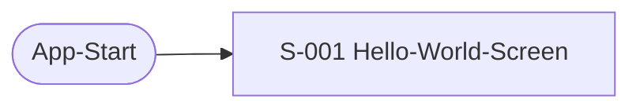

# UI

Die Oberfläche. **Welche Screens gibt es, und in welcher Reihenfolge?**

## So arbeitest du mit diesem Template

Der Text hier ist der **Anker**. Das Mockup ist die **Überprüfung**.

1. Wähle einen Screen.
2. Beschreibe ihn textuell (Zweck, Ablauf, Ergebnis).
3. Lass ihn generieren (Mockup).
4. Schau ihn an.
5. Ändere den Text, wenn nötig.
6. Wiederhole 3–5, bis es passt.
7. Mach weiter mit dem nächsten Screen.

Der Kreislauf endet, wenn **du** sagst: „So passt es."
Es gibt keine andere Abbruchbedingung.

## Fragen

### 1. Welche Screens gibt es?

Für jeden Screen:
- **ID**
- **Name**
- **Zweck** — was tut der Mensch hier?
- **Ablauf** — was passiert?
- **Ergebnis** — was ist danach anders?
- **Rolle** — zentral oder peripher?
- **Zeigt** — welche Komponente? (`C-`)
- **Beachtet** — welches Nicht-Ziel begrenzt ihn? (`NG-`, wenn eines)

Keine Layout-Details. Keine Farben. Keine Positionen. Das kommt im Mockup.

#### S-001 Hello-World-Screen

- **Zweck:** nichts zu tun — der Screen zeigt sich selbst. Er ist der
  sichtbare Beweis, dass Build und Deployment funktioniert haben.
- **Ablauf:** App startet, Text erscheint sofort.
- **Ergebnis:** keins. Der Screen verändert nichts, er zeigt nur an.
- **Rolle:** zentral — der einzige Screen, und genau der, an dem G-003
  (sichtbare Source-zu-Store-Kette) beobachtet wird.
- **Zeigt:** C-002.
- **Beachtet:** NG-001 (keine echte App-Funktionalität).

### 2. In welcher Reihenfolge werden die Screens durchlaufen?

Als Diagramm. (Mermaid.)

Es gibt nur einen Screen, also keine Reihenfolge im eigentlichen Sinn.

### 3. Welche Screens sind zentral?

Zentral heißt: Der Screen gehört zur Kernlogik.
Peripher heißt: Er ist da, um die Kernlogik zu ermöglichen.

S-001 ist zentral in der UI — es gibt keine peripheren Screens. Das
ändert nichts an `struktur.md`: Dort ist C-001 (der CI/CD-Workflow) die
Kernlogik des Gesamtsystems, C-002 und damit S-001 bleiben dort
peripher. Innerhalb der UI selbst ist S-001 aber der einzige und damit
zentrale Screen.

## Was hier entsteht

- `S-` Screens

Ordner: `projekt/ui/`

Ein abgestimmter Eintrag trägt darunter die Zeile
`Abgestimmt: <wer>, <wann>` — ab dann ist seine ID verbraucht und wird bei
Aufgabe ausgemustert statt umnummeriert (`metamodell.md`).

Ausgemustert: —

## Querverweise

- **Geht aus:** `zeigt` → C-, `beachtet` → NG-
- **Kommt an:** `bedient` von A-, `prueft` von T-, `betrifft` von RISK-,
  `entscheidet-ueber` von ADR-

## Was hier nicht entsteht

- Mockups (die entstehen im Kreislauf, separat)
- Layout-Details (die kommen im Mockup)
- Technische Umsetzung (die kommt später)

## Zustand

- [x] Welche Screens gibt es?
- [x] In welcher Reihenfolge werden die Screens durchlaufen?
- [x] Welche Screens sind zentral?

## Notizen
